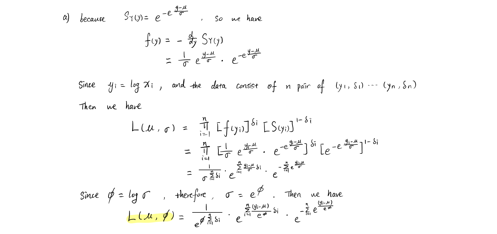
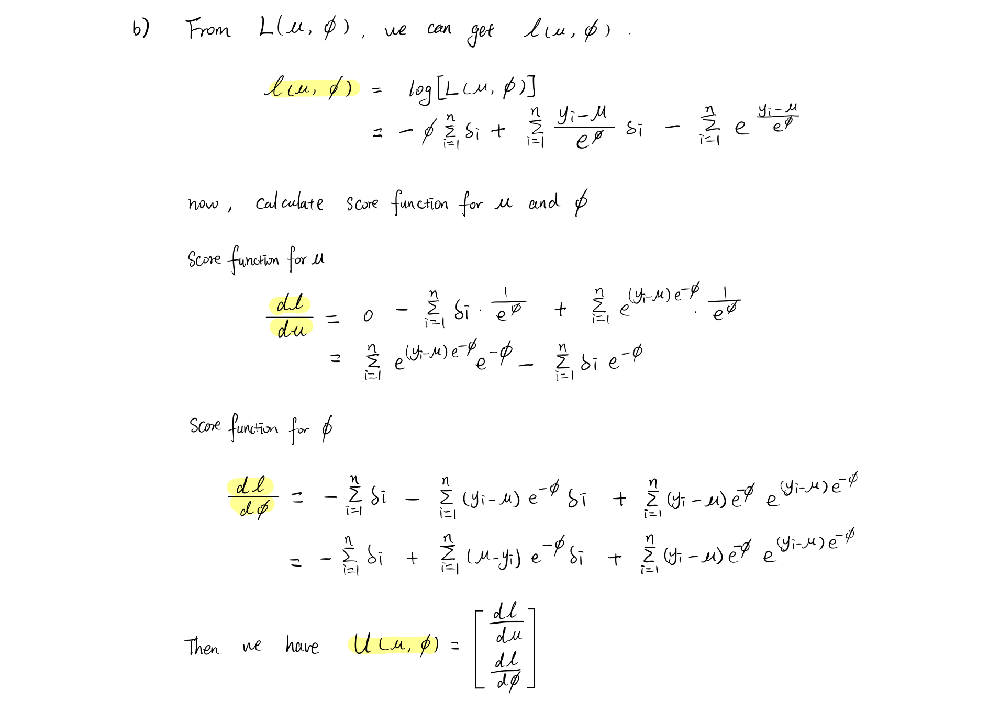
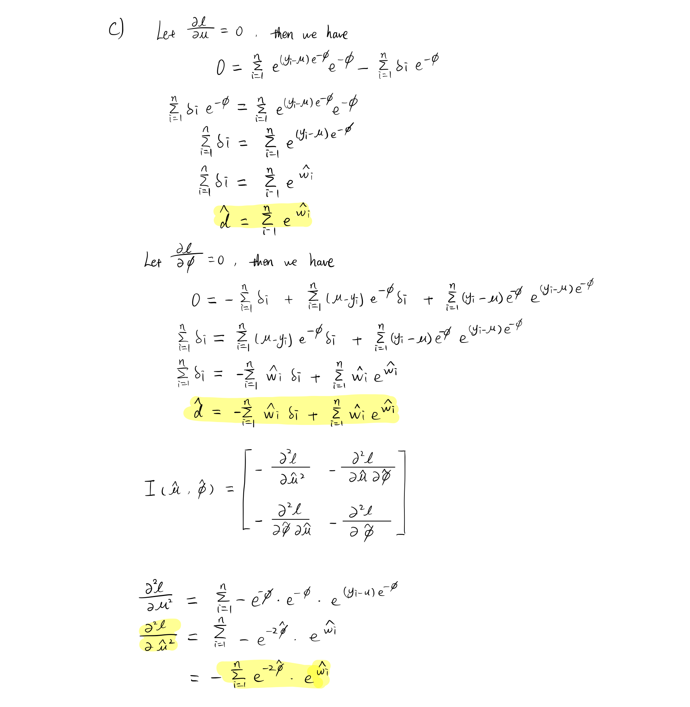
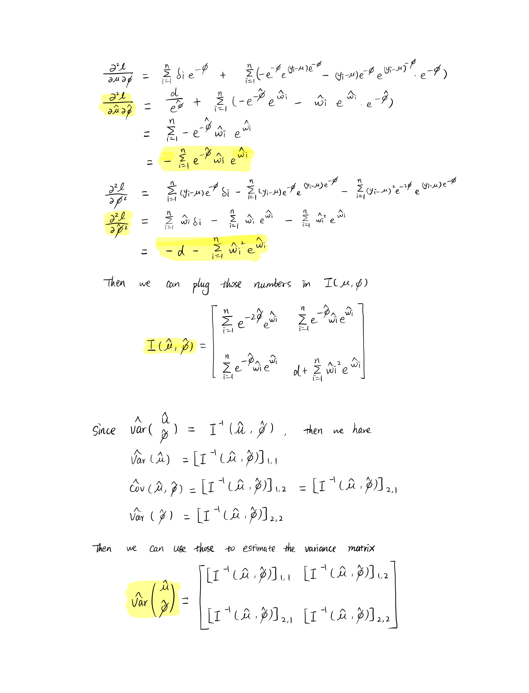

```{r setup, include=FALSE}
knitr::opts_chunk$set(echo = TRUE)
```

## Question 1

```{=latex}
From lecture, we know by greenwood's formula, we have\\
    \[
    \Hat{Var}[\hat{S}(t)] = [\hat{S}(t)]^2 \sum_{j:a_j<t} \frac{d_j}{n_j(n_j - d_j)}
    \]\\
    Now, let $Z = \hat{S}(t), g(Z) = log[-log \hat{S}(t)]$, then we have\\
    \begin{align*}
        g'(Z) &= \frac{d}{dZ} log[-log Z]\\
        &= \frac{-1}{log(Z)} \frac{d}{dZ} [-log(Z)] \tag{by chain rule}\\
        &= \frac{-1}{log(Z)} \frac{-1}{Z}\\
        &= \frac{1}{Zlog(Z)}\\
        &= \frac{1}{\hat{S}(t)log(\hat{S}(t))} \tag{since $Z =  \hat{S}(t)$}
    \end{align*}
    By the $\Delta$-method, we have $Var[g(Z)] \approx [g'(Z)]^2 Var(Z)$, the we have\\
    \begin{align*}
        Var[g(Z)] &= [\frac{1}{\hat{S}(t)log(\hat{S}(t))}]^2 * [\hat{S}(t)]^2 \sum_{j:a_j<t} \frac{d_j}{n_j(n_j - d_j)}\\
        &= [\frac{1}{log(\hat{S}(t))}]^2 * \sum_{j:a_j<t} \frac{d_j}{n_j(n_j - d_j)}\\
        &= [\frac{1}{log(\prod_{j:a_j < t}(1 - \frac{d_j}{n_j}))}]^2 * \sum_{j:a_j<t} \frac{d_j}{n_j(n_j - d_j)} \tag{KM estimate}\\ 
        &= [\frac{1}{\sum_{j:a_j < t}log(1 - \frac{d_j}{n_j})}]^2 * \sum_{j:a_j<t} \frac{d_j}{n_j(n_j - d_j)}\\
        &= \frac{\sum_{j:a_j<t} \frac{d_j}{n_j(n_j - d_j)}}{[\sum_{j:a_j < t}log(1 - \frac{d_j}{n_j})]^2}\\
        &= \frac{\sum_{j:a_j<t} \{d_j/n_j(n_j - d_j)\}}{{[\sum_{j:a_j < t}log(1 - d_j/n_j)]^2}}
    \end{align*}
    Now, we have proved \[\Hat{Var}\{log[-log\hat{S}(t)]\}= \frac{\sum_{j:a_j<t} \{d_j/n_j(n_j - d_j)\}}{{[\sum_{j:a_j < t}log(1 - d_j/n_j)]^2}}\]\\
    Now, we have proved \[\Hat{Var}\{log[-log\hat{S}(t)]\}= \frac{\sum_{j:a_j<t} \{d_j/n_j(n_j - d_j)\}}{{[\sum_{j:a_j < t}log(1 - d_j/n_j)]^2}}\]\\
    For confidence interval, we can use transformation method because we already have log(-log) transformation. Then let $\Psi = log[-log\hat{S}(t)]$, so we have $\Hat{Var}(\Psi) = \Hat{Var}\{log[-log\hat{S}(t)]\}$ Since we already have $\Hat{Var}\{log[-log\hat{S}(t)]\}$, so we can just use this. By the property of MLE's, we know $Z = \frac{\hat{\Psi} - \Psi}{\Hat{Var}(\Psi) ^{\frac{1}{2}}} \approx N(0,1)$. follow the same procedure from lecture, we have a CI for $\Psi$, $\Hat{\Psi_L} \le \Psi \le \Hat{\Psi_U}$ or ($\Hat{\Psi_L}, \Hat{\Psi_U}$). \\
    \begin{align*}
        \Hat{\Psi_L} &= \hat{\Psi} - Z_{1-\alpha/2}[\hat{Var}({\hat{\Psi}})]^{\frac{1}{2}}\\
        &= log[-log(\prod_{j:a_j < t}(1 - \frac{d_j}{n_j}))] - Z_{1-\alpha/2}[\frac{\sum_{j:a_j<t} \{d_j/n_j(n_j - d_j)\}}{{[\sum_{j:a_j < t}log(1 - d_j/n_j)]^2}}]^{\frac{1}{2}}\\
        \Hat{\Psi_U} &= \hat{\Psi} + Z_{1-\alpha/2}[\hat{Var}({\hat{\Psi}})]^{\frac{1}{2}}\\
        &= log[-log(\prod_{j:a_j < t}(1 - \frac{d_j}{n_j}))] + Z_{1-\alpha/2}[\frac{\sum_{j:a_j<t} \{d_j/n_j(n_j - d_j)\}}{{[\sum_{j:a_j < t}log(1 - d_j/n_j)]^2}}]^{\frac{1}{2}}\\
        P&(\Hat{\Psi_L} \le \Psi \le \Hat{\Psi_U}) = 1 - \alpha\\
        P&(\Hat{\Psi_L} \le log[-log S(t)] \le \Hat{\Psi_U}) = 1 - \alpha\\
    \end{align*}
    After this, we can apply inverse function of g() to the former CI interval to get CI for S(t) which is $(\hat{S_L}(t), \hat{S_U}(t))$.
    \begin{align*}
        P&(e^{\Hat{\Psi_L}} \le -log S(t) \le e^{\Hat{\Psi_U}}) = 1 - \alpha\\
        P&(-e^{\Hat{\Psi_L}} \le log S(t) \le -e^{\Hat{\Psi_U}}) = 1 - \alpha\\
        P&(e^{-e^{\Hat{\Psi_L}}} \le S(t) \le e^{-e^{\Hat{\Psi_U}}}) = 1 - \alpha\\
    \end{align*}
```

\newpage
## Question 2

```{=latex}
\begin{itemize}
\item[a)]
    Since $logT = \mu + \sigma W$, so $W = \frac{logT - \mu}{\sigma}$. Then we have \\
    \begin{align*}
        F_T(t) &= P(T \le t)\\
        &= P(e^{\mu + \sigma W} \le t)\\
        &= P(W \le \frac{logt - \mu}{\sigma})\\
        &= F_W(\frac{logt - \mu}{\sigma})\\
        &= 1 - e^{-e^{\frac{logt - \mu}{\sigma}}}
    \end{align*}
    Now, let $\mu = -\sigma log(\lambda), \sigma = 1/\beta$, then we have $\lambda = e^{-\mu/\sigma}, \beta = 1/\sigma$. plug this back in we have\\
    \begin{align*}
        F_T(t) &= 1 - e^{-e^{(logt + \frac{1}{\beta}log\lambda) \beta}}\\
        &= 1 - e^{-e^{(logt^\beta + log\lambda)}}\\
        &= 1 - e^{-e^{(log\lambda t^\beta)}}\\
        &= 1 - e^{-\lambda t^\beta}\\
        S_T(t) &= 1 - F_T(t)\\
        &= e^{-\lambda t^\beta} \tag{$t > 0, \lambda > 0, \beta > 0$}
    \end{align*}
    Now we can see this is the survival function of Weibull distribution, so we can conclude T has a Weibull distribution. The relationships are $\mu = -\sigma log(\lambda), \sigma = 1/\beta$.
    \item[b)]
    Since $\beta = 1/\sigma$, so we have $\beta = 1/1 =1$, Plug this back to the survival function for T, Then\\
    \[ S_T(t) =  e^{-\lambda t}\]\\
    This matches the survival function for exponential distribution, so we know T has an exponential distribution when $\sigma = 1$
\end{itemize}
```

\newpage
## Question 3

```{r, echo=FALSE, out.width = '100%'}




```

\newpage
## Question 4

```{=latex}
\begin{itemize}
    \item[a)]
    Since we have an exponential distribution with hazard rate $\lambda$, Then \[f(t) = \lambda e^{-\lambda t}\]. From here, we have
    \begin{align*}
        L(\lambda) &= \prod_{i = 1}^n [f(t)]^{\delta_i} [S(t)]^{1-\delta_i}\\
        &= \prod_{i = 1}^n [\lambda e^{-\lambda x_i}]^{\delta_i} [e^{-\lambda x_i}]^{1-\delta_i} \tag{let $x_i$ be t at certain time point}\\
        &= \prod_{i = 1}^n [\lambda]^{\delta_i} e^{-\lambda x_i}\\
        &= [\lambda]^{\sum_{i=1}^n \delta_i} e^{-\lambda \sum_{i=1}^n x_i}\\
        \ell(\lambda) &= log([\lambda]^{\sum_{i=1}^n \delta_i} e^{-\lambda \sum_{i=1}^n x_i}) \tag{log likelihood}\\
        &= \sum_{i=1}^n \delta_i log \lambda - \lambda  \sum_{i=1}^n x_i
    \end{align*}
    Now, we have the log-likelihood function for $\lambda$, and next step is to get the mle\\
    \begin{align*}
        \ell'(\lambda) &= \frac{d}{d\lambda}(\sum_{i=1}^n \delta_i log \lambda - \lambda  \sum_{i=1}^n x_i)\\
        &= \sum_{i=1}^n \delta_i \frac{1}{\lambda} - \sum_{i=1}^n x_i\\
        0 &= \sum_{i=1}^n \delta_i \frac{1}{\lambda} - \sum_{i=1}^n x_i \tag{score equation}\\
        \hat{\lambda} &= \frac{\sum_{i=1}^n \delta_i}{\sum_{i=1}^n x_i}\\
        &= \frac{6}{6+4+6+3+9+9+10+13+11} \tag{take in values}\\
        &= 0.084
    \end{align*}\\
    Now, for mean survival time\\
    \begin{align*}
        \theta &= E(T) = \frac{1}{\lambda}\\
        \hat{\theta} &= \frac{1}{\hat{\lambda}}\tag{invariance property}\\
        &= \frac{1}{\frac{\sum_{i=1}^n \delta_i}{\sum_{i=1}^n x_i}}\\
        &= \frac{\sum_{i=1}^n x_i}{\sum_{i=1}^n \delta_i}\\
        &= 1/0.084\\
        &= 11.9
    \end{align*}\\
    Now we have the mle for both hazard rate and mean survival time.\\
    
    \item[b)]
    We can just use the KM estimate formula and greenwood's formula to get $\hat{S}(t)$, and $Var\hat{S}(t)$\\
    \begin{table}[H]
    \centering
    \begin{tabular}{|l|l|l|l|l|l|}
    \hline
    j & $a_j$ & $n_j$ & $d_j$   & $\hat{S}(t)$                    & $Var \hat{S}(t) $                                                                                 \\\hline
    1 & 3   & 10  & 1           & $1-\frac{1}{10} = 0.9$        & $0.9^2 \frac{1}{10(10-1)} = 0.009$                                                                          \\\hline
    2 & 4   & 9   & 1           & $0.9(1-\frac{1}{9}) = 0.8$    & $0.8^2 [\frac{1}{10(10-1)} + \frac{1}{9(9-1)}] = 0.016$                                                    \\\hline
    3 & 6   & 8   & 2           & $0.8(1-\frac{2}{8}) = 0.6$    & $0.6^2 [\frac{1}{10(10-1)} + \frac{1}{9(9-1)} + \frac{2}{8(8-2)}] = 0.024$                                  \\\hline
    4 & 9   & 6   & 1           & $0.6(1-\frac{1}{6}) = 0.5$    & $0.5^2 [\frac{1}{10(10-1)} + \frac{1}{9(9-1)} + \frac{2}{8(8-2)} + \frac{1}{6(6-1)}] = 0.025$               \\\hline
    5 & 13  & 1   & 1           & $0.5(1-1) = 0$                & $0^2 [\frac{1}{10(10-1)} + \frac{1}{9(9-1)} + \frac{2}{8(8-2)} + \frac{1}{6(6-1)} + \frac{1}{1-1}] = 0$ \\\hline
    \end{tabular}
    \end{table}

    \item[c)]
    we know $\hat{\mu} =$ area under $\hat{S}(t)$, so we can use the data from part b to calculate the mean\\
    \begin{align*}
        \hat{\mu} &= a_1 + \hat{S}(a_1t)(a_2 - a_1) + ... + \hat{S}(a_{k-1}t)(a_k - a_{k-1})\\
        &= 3 + 0.9*1 + 0.8*2 + 0.6*3 + 0.5*4 + 0\\
        &= 8.7
    \end{align*}
    we can see the result are not exactly the same, this may because we are assuming the survival time has exponetial distribution, but we don't make any assumption here. Also, we can see most of the censoring happends to the end of the study, so this will cause the mean estimation in the mle method be greater. in addition, the mle method will calculate integral of S(t) from 0 to $\infty$, this can also the cause a greater estimation.  Overall, this nonparametric estimate seems agree with the corresponding parametric estimate.
    \item[d)] 
    To plot the KM curve, we need to first set one vector for time and another vactor for failure status. then we can use survfit function to fit a KM curve on the two vectors, then we can plot it out. In here, I used the log-log parameter for CI, this ensure that CI will not exceed 1.
\end{itemize}
```
```{r, echo=FALSE}
library(survival)
times <- c(6,4,6,3,9,9,10,13,11)
delta <- c(1,1,1,1,0,1,0,1,0)
eq <- function(x) exp(-0.084*x)
fit <- survfit(Surv(times, delta) ~ 1, conf.type = "log-log")
plot(fit, xlab = "Time", ylab = "Estimated Survival", mark.time = T, conf.int = T)
curve(eq, from = 0, to = 15, col=2, add = T)
```

The exponential model in a) fits the data pretty well, we can see the exponential curve is in between the point-wise CI from 3 to 13, therefore, between this interval, the exponential model can give a good estimation.

\newpage
## Question 5

a) we will first split the hiv data by two treatment, then use survfit function to fit both KM and MA estimate for thew two groups. After this. we ca plot them in a single plot to see the difference. because we are compare the survival function, not the cumulative hazard, so I used the default parameter for ctype in survfit function. confidence interval was setted to log-log base

```{r, echo=FALSE, fig.width=10, fig.height=12}
df <- read.table("hiv.txt", header = T)
g1 <- df[which(df$grp == 1),]
g2 <- df[which(df$grp == 2),]
x1 <- g1$time; x2 <- g2$time
delta1 <- g1$status; delta2 <- g2$status
fit_km1 <- survfit(Surv(x1, delta1) ~ 1, stype = 1, conf.type = "log-log")
fit_na1 <- survfit(Surv(x1, delta1) ~ 1, stype = 2, conf.type = "log-log")
fit_km2 <- survfit(Surv(x2, delta2) ~ 1, stype = 1, conf.type = "log-log")
fit_na2 <- survfit(Surv(x2, delta2) ~ 1, stype = 2, conf.type = "log-log")
par(mfrow = c(2,2))
plot(fit_km1, xlab="Time (months)", ylab="Estimated S(t)", mark.time=T,conf.int=F, main = "Two drug")
lines(fit_na1, conf.int=F, col = 2)
legend("topright",0.95,c("KM", "NA"), lty = 1:1, col = 1:2)
plot(fit_km2, xlab="Time (months)", ylab="Estimated S(t)", mark.time=T,conf.int=F, main = "Triple drug")
lines(fit_na2, conf.int=F, col=2)
legend("topright",0.95,c("KM", "NA"), lty = 1:1, col = 1:2)
plot(fit_km1, xlab="Time (months)", ylab="Estimated S(t)", mark.time=T,conf.int=T, main = "Kaplan-Meier")
lines(fit_km2, conf.int=T, col = 2)
legend("topright",0.95,c("two-drug", "triple-drug"), lty = 1:1, col = 1:2)
plot(fit_na1, xlab="Time (months)", ylab="Estimated S(t)", mark.time=T,conf.int=T, main = "Nelson-Aalen")
lines(fit_na2, conf.int=T, col=2)
legend("topright",0.95,c("two-drug", "triple-drug"), lty = 1:1, col = 1:2)
```

From the top two plots, we can see both Kaplan-Meier estimate and the Nelson-Aalen estimate gives similar results, the overall pattern are very similar. in general, the NA estimate is higher than the KM estimate. For the two plot below, we can clearly see the overall survival function has a big difference between two drug group and triple drug group. However, when we look at the confidence interval, we can see the confidence interval is overlapping at any time point between two group, therefore, there is a chance that the two method may have similar effect. Thus, we can not simply conclude the triple drug group has higher survival probability than the two drug group. we can just say the participants in triple drug group may performs batter than the two drug group.

b) we can use summary function to check the median for each group, then we can use survfit function to git model with conf.type set to log-log and plain two get the two confidence interval at time 60. since we already used log-log confidence interval in part b) so we can just use summary function on the model we have in part b).

```{r, echo=FALSE}
fit_km3 <- survfit(Surv(x1, delta1) ~ 1, stype = 1, conf.type = "plain")
fit_km4 <- survfit(Surv(x2, delta2) ~ 1, stype = 1, conf.type = "plain")
summary(fit_km1)
summary(fit_km3)
summary(fit_km2)
summary(fit_km4)
```
From the first summary, we can see the estimate median is between T=45 and T=49, so the approximated median T would be 49 because the survival rate at T=49 is the greatest number that smaller than 0.5. For two drug group, we can see from the plot in b) that at time 60, the survival probability and confidence interval should be the same as T=49, so we have approximate plain CI: (0.2294, 0.733), and log-log CI:(0.22410, 0.699). For triple drug group, T = 60 is in between T=48 and T=80, so simile as above, we have CI at T=60 = CI at T=60, therefore, we have approximate plain CI: (0.4199, 0.874) and log-log CI: ( 0.3771, 0.823)

c) To plot cumulative hazard function, we just need to specify the parameter cumhaz=T in plot function. because the default ctype in survfit function is NA estimate, so we don't need to change the code too much. 

```{r, echo=FALSE, fig.height=10}
par(mfrow = c(2,1))
plot(fit_na1, xlab="Time (months)", ylab="Estimated H(t)", mark.time=T,conf.int=F, main = "Two drug", cumhaz = T, xlim = c(0,250), ylim = c(0,3))
plot(fit_na2, xlab="Time (months)", ylab="Estimated H(t)", mark.time=T,conf.int=F, main = "Triple drug", cumhaz = T, xlim = c(0,250), ylim = c(0,3))
```

For two-drug group, we can see the the H(t) stop increases at the end period, this is because the last data point in the file is censored. if we ignore the last part, then the H(t) seems have curve shape. the slop increase as time increases. 

For triple drug group, because the last person is a failure, so the data has an increasing at the end. The interest thing about this plot is the slope of this plot decreases as the time increases at the beginning, and then the slope increases as the time increases. 

In both plot, when there is censoring happens, the slope is decreasing in both graph. Also, it means no failure happens in this period of time. this is because the time between two time points increases and stretch the curve to the right. 

Weibull distribution would be reasonable to model T, because form the H(t) plot, we can see there is a increase trend happens in both group and the increasing rate is getting bigger as time pass, this fits the h(t) function for weibull distribution. ALso, we can see the survival plot form b) has similar shape as a weibull distribution. So Weibull distribution is reasonable to model T. To check this, I will plot the Weibull distribution survival curve in to the KM curve

```{r, fig.height=6, echo=FALSE}
fit.weib1 <- survreg(Surv(x1, delta1) ~ 1)
sigma1 <- fit.weib1$scale
mu1 <- fit.weib1$coefficients
t1 <- 0:180
sf.weib1 <- exp(-exp((log(t1)- mu1)/sigma1))

fit.weib2 <- survreg(Surv(x2, delta2) ~ 1)
sigma2 <- fit.weib2$scale
mu2 <- fit.weib2$coefficients
t2 <- 0:238
sf.weib2 <- exp(-exp((log(t2)- mu2)/sigma2))

par(mfrow = c(2,1))

plot(fit_km1, xlab="Time (months)", ylab="Estimated S(t)", 
     mark.time=T,conf.int=F, main = "Two drug")
lines(t1,sf.weib1, lty = 2)

plot(fit_km2, xlab="Time (months)", ylab="Estimated S(t)", 
     mark.time=T,conf.int=F, main = "Triple drug")
lines(t2,sf.weib2, lty = 2)
```

We can see the Weibull distribution gives similar estimate as KM curve, so we can conclude that Weibull distribution is reasonable to model T.

\newpage
## Appendix

### Question 4

KM plots

```{r, eval=FALSE}
library(survival)
times <- c(6,4,6,3,9,9,10,13,11)
delta <- c(1,1,1,1,0,1,0,1,0)
eq <- function(x) exp(-0.084*x)
fit <- survfit(Surv(times, delta) ~ 1, conf.type = "log-log")
plot(fit, xlab = "Time", ylab = "Estimated Survival", mark.time = T, conf.int = T)
curve(eq, from = 0, to = 13, col=2, add = T)
```

### Question 5

part a)

```{r, eval=FALSE}
df <- read.table("hiv.txt", header = T)
g1 <- df[which(df$grp == 1),]
g2 <- df[which(df$grp == 2),]
x1 <- g1$time; x2 <- g2$time
delta1 <- g1$status; delta2 <- g2$status
fit_km1 <- survfit(Surv(x1, delta1) ~ 1, stype = 1)
fit_na1 <- survfit(Surv(x1, delta1) ~ 1, stype = 2)
fit_km2 <- survfit(Surv(x2, delta2) ~ 1, stype = 1)
fit_na2 <- survfit(Surv(x2, delta2) ~ 1, stype = 2)
plot(fit_km1, xlab="Time (months)", ylab="Estimated S(t)", mark.time=T,conf.int=F)
lines(fit_na1, conf.int=F,lty=2)
lines(fit_km2, conf.int=F, col = 2)
lines(fit_na2, conf.int=F,lty=2, col=2)
legend("topright",0.95,c("Kaplan-Meier", "Nelson-Aalen", "two-drug", "triple-drug"),
       lty=c(1,2,1,1), col = c(1,1,1,2))
```

part b)

```{r, eval=FALSE}
fit_km3 <- survfit(Surv(x1, delta1) ~ 1, stype = 1, conf.type = "plain")
fit_km4 <- survfit(Surv(x2, delta2) ~ 1, stype = 1, conf.type = "plain")
summary(fit_km1)
summary(fit_km3)
summary(fit_km2)
summary(fit_km4)
```

part c)

```{r, eval=FALSE}
par(mfrow = c(1,2))
plot(fit_na1, xlab="Time (months)", ylab="Estimated H(t)", 
     mark.time=T,conf.int=F, main = "Two drug", cumhaz = T, 
     xlim = c(0,250), ylim = c(0,3))
plot(fit_na2, xlab="Time (months)", ylab="Estimated H(t)", 
     mark.time=T,conf.int=F, main = "Triple drug", cumhaz = T, 
     xlim = c(0,250), ylim = c(0,3))
```

part c) check

```{r, fig.height=6, eval=FALSE}
fit.weib1 <- survreg(Surv(x1, delta1) ~ 1)
sigma1 <- fit.weib1$scale
mu1 <- fit.weib1$coefficients
t1 <- 0:180
sf.weib1 <- exp(-exp((log(t1)- mu1)/sigma1))

fit.weib2 <- survreg(Surv(x2, delta2) ~ 1)
sigma2 <- fit.weib2$scale
mu2 <- fit.weib2$coefficients
t2 <- 0:238
sf.weib2 <- exp(-exp((log(t2)- mu2)/sigma2))

par(mfrow = c(2,1))

plot(fit_km1, xlab="Time (months)", ylab="Estimated S(t)", 
     mark.time=T,conf.int=F, main = "Two drug")
lines(t1,sf.weib1, lty = 2)

plot(fit_km2, xlab="Time (months)", ylab="Estimated S(t)", 
     mark.time=T,conf.int=F, main = "Triple drug")
lines(t2,sf.weib2, lty = 2)
```
