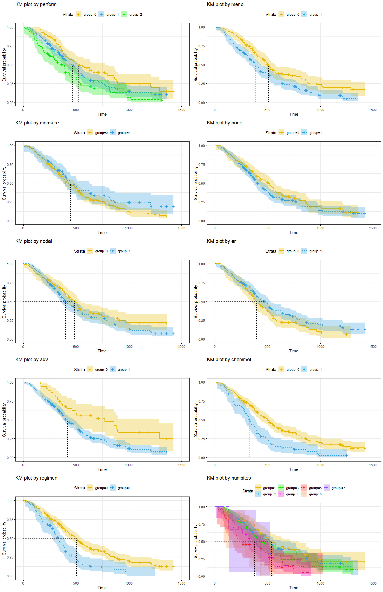

```{r setup, include=FALSE}
knitr::opts_chunk$set(echo = TRUE)
```

## Part I. Problems

\newpage
.\newpage
.\newpage
.\newpage

## Part II. Analysis of Breast Cancer Data

## **INTRODUCTION**

```{=latex}
Data were obtained from a randomized Phase III study that compared vinorelbine plus doxorubicin (new treatment) with doxorubicin alone (standard treatment) in 300 patients with disseminated metastatic/recurrent breast cancer. The response failure time is described by the time from recurrence to death. Furthermore, several covariates are collected before treatment, such as age, performance status, pre-menopausal status, tumor measure status, WBC, Blood granulocyte count, and Blood platelet count. This study aims to examine if the investigated treatment could extend the post-progression survival time compared to the standard treatment and to discover the associations with other covariates.\\

To begin with, we want to see the distribution of each covariate and get a sense of the data set. Next, non-parametric methods such as Kaplan-Meier estimates and (weighted) log-rank tests can be used to examine the differences between each category. In the next step, the parametric model will be fitted into the data and compared to KM-curve to find the optimal fit. After that, we will use the AFT model to determine which covariates are significant. Following that, the semi-parametric model like Cox regression will be applied to identify the significant covariates and show how those variables affect the survival time from recurrence. PH assumption will be verified by model checking at the end.
```

## **Preliminary analysis**

```{=latex}
The 'br\_surv' data has 300 observations with 18 feature vectors of interest (excluding ID, time, and status). First, we would like to see how much missing data there are in the dataset. after calculation, we found that there are 2 missing data points in both meno and global categories and 34 in both nodal and er categories. Because 2 missing data is less than 2%, we will remove the two rows. To deal with the missing data in nodal and er categories, we will first check if those two variables are significant or not.\\

For all continuous variables in the dataset, including age, timediag, disfree, WBC, granules, and platelets, a scatter plot will be constructed because continuous variables does not have lot missing data. Since the range for x-axis is large, log will be take for each continuous variable to get better view of the data. For categorical data, KM-plot will be generated as this can avoid the effect of missing data. Both method will be use to assess the potential association between each covariate (excluding arm) and survival time.  
```

```{r covariate_check_for_continous_variable, fig.height=10, fig.width=10, echo=F}
# read data first
br_surv <- read.table("br_surv.txt", header = T, na.strings = ".")
#ncol(br_surv)

# NA represent missing data, check missing data
# need to check which variable is significant
#colSums(is.na(br_surv))
#remove column if less than 2%
br_surv <- br_surv[which(!is.na(br_surv$meno)&!is.na(br_surv$global)),]

#colSums(is.na(br_surv))

# scatter plot for continuous variable because continuous variables does not have lot missing data
# since the range for x-axis is large, log will be take for each variable. 
par(mfrow = c(3,2))
plot(log(br_surv$age), log(br_surv$survival)) #negative relation
plot(log(br_surv$timdiag), log(br_surv$survival)) # negative relation
plot(log(br_surv$disfree), log(br_surv$survival)) # seems no relation
plot(log(br_surv$WBC), log(br_surv$survival)) # seems no relation
plot(log(br_surv$gran), log(br_surv$survival)) # slightly negative
plot(log(br_surv$platelet), log(br_surv$survival))# slightly negative
mtext(~italic("my caption"), side=1, outer=TRUE, adj=0, line=3) 
```

```{=latex}
From the above scatter plots, we can see age, timediag, WBC, and gran seem to have negative association with survival time. The variable disfree, platelet seems to have very week association with survival time. Therefore, we can not eliminate any of the variable for our future analysis.
```

```{r, echo=F, message=F, warning=F}
library(survival)
library(ggplot2)
library(survminer)

################### Variable checking ########################################
time <- br_surv$survival
status <- br_surv$dead
```

```{r KM covariate check, echo=F,fig.align = 'center',fig.cap="KM plot for covariate"}
# the missing data is over 10% for certain binary data, so a scatter plot may not be effective in investigate the effect, so KM plots will be generated for all binary variables to check whether a variable will affect the survival or not.


```

```{=latex}
From the KM-plots above, we can see perform, meno, adv, chemmet. regimen and numsites seems to have big impact on survival time. other variables seems not have strong impact. To check the difference, log-rank and wilcoxon test will be performed to check which variables are significant.
```

```{r willcoxon test, echo=F}
## willcoxon test
pval <- c()
lr <- c()
names <- c("perform","meno","measure","numsites","bone","nodal","er","adv","chemmet","regimen")
wilcx<-survdiff(Surv(time,status)~as.factor(perform), data=br_surv,rho=1)
pval <- c(pval, pchisq(wilcx$chisq, length(wilcx$n)-1, lower.tail = FALSE))

wilcx<-survdiff(Surv(time,status)~as.factor(meno), data=br_surv,rho=1)
pval <- c(pval, pchisq(wilcx$chisq, length(wilcx$n)-1, lower.tail = FALSE))

wilcx<-survdiff(Surv(time,status)~as.factor(measure), data=br_surv,rho=1)
pval <- c(pval, pchisq(wilcx$chisq, length(wilcx$n)-1, lower.tail = FALSE))

wilcx<-survdiff(Surv(time,status)~as.factor(numsites), data=br_surv,rho=1)
pval <- c(pval, pchisq(wilcx$chisq, length(wilcx$n)-1, lower.tail = FALSE))

wilcx<-survdiff(Surv(time,status)~as.factor(bone), data=br_surv,rho=1)
pval <- c(pval, pchisq(wilcx$chisq, length(wilcx$n)-1, lower.tail = FALSE))

wilcx<-survdiff(Surv(time,status)~as.factor(nodal), data=br_surv,rho=1)
pval <- c(pval, pchisq(wilcx$chisq, length(wilcx$n)-1, lower.tail = FALSE))

wilcx<-survdiff(Surv(time,status)~as.factor(er), data=br_surv,rho=1)
pval <- c(pval, pchisq(wilcx$chisq, length(wilcx$n)-1, lower.tail = FALSE))

wilcx<-survdiff(Surv(time,status)~as.factor(adv), data=br_surv,rho=1)
pval <- c(pval, pchisq(wilcx$chisq, length(wilcx$n)-1, lower.tail = FALSE))

wilcx<-survdiff(Surv(time,status)~as.factor(chemmet), data=br_surv,rho=1)
pval <- c(pval, pchisq(wilcx$chisq, length(wilcx$n)-1, lower.tail = FALSE))

wilcx<-survdiff(Surv(time,status)~as.factor(regimen), data=br_surv,rho=1)
pval <- c(pval, pchisq(wilcx$chisq, length(wilcx$n)-1, lower.tail = FALSE))

lgrk <- survdiff(Surv(time,status)~as.factor(perform), data=br_surv)
lr <- c(lr, pchisq(lgrk$chisq, length(lgrk$n)-1, lower.tail = FALSE))

wilcx<-survdiff(Surv(time,status)~as.factor(meno), data=br_surv)
lr <- c(lr, pchisq(wilcx$chisq, length(wilcx$n)-1, lower.tail = FALSE))

wilcx<-survdiff(Surv(time,status)~as.factor(measure), data=br_surv)
lr <- c(lr, pchisq(wilcx$chisq, length(wilcx$n)-1, lower.tail = FALSE))

wilcx<-survdiff(Surv(time,status)~as.factor(numsites), data=br_surv)
lr <- c(lr, pchisq(wilcx$chisq, length(wilcx$n)-1, lower.tail = FALSE))

wilcx<-survdiff(Surv(time,status)~as.factor(bone), data=br_surv)
lr <- c(lr, pchisq(wilcx$chisq, length(wilcx$n)-1, lower.tail = FALSE))

wilcx<-survdiff(Surv(time,status)~as.factor(nodal), data=br_surv)
lr <- c(lr, pchisq(wilcx$chisq, length(wilcx$n)-1, lower.tail = FALSE))

wilcx<-survdiff(Surv(time,status)~as.factor(er), data=br_surv)
lr <- c(lr, pchisq(wilcx$chisq, length(wilcx$n)-1, lower.tail = FALSE))

wilcx<-survdiff(Surv(time,status)~as.factor(adv), data=br_surv)
lr <- c(lr, pchisq(wilcx$chisq, length(wilcx$n)-1, lower.tail = FALSE))

wilcx<-survdiff(Surv(time,status)~as.factor(chemmet), data=br_surv)
lr <- c(lr, pchisq(wilcx$chisq, length(wilcx$n)-1, lower.tail = FALSE))

wilcx<-survdiff(Surv(time,status)~as.factor(regimen), data=br_surv)
lr <- c(lr, pchisq(wilcx$chisq, length(wilcx$n)-1, lower.tail = FALSE))

df <- data.frame(wilcx_pval = pval,
                 logrank_pval = lr, 
                 row.names = names)
knitr::kable(df)

# because both Wilcoxon and log rank test shows nodal and er has p-value
# greater than 0.05, so this two variables will not be included in the model,
# and therefore, we can remove the two column form the data frame
br_surv <- subset(br_surv, select=-c(nodal,er))
```

```{=latex}
From the wilcoxon and log-rank test, we can see perform, meno, numsites, adv, chemmet and regimen are statistically significant. Other variables are not statistically significant. For nodal and er, both wilcoxon and log-rank test have a p-value larger than 0.05 indicates they are important, so we can remove the two coulmn form our dataset. Interstingly, chemmet and regimen has exactly the same value in the dataset, but we will keep both variable for further analysis.\\

Next, we will use KM-plot to get a sense of the data. Then Parametric model will be included in plot to see which Parametric model has best fit for our data. Weibull, Exponetial and lognormal distribution were used in here. To assess the effect of arm, both Parametric and non-parametric comparison will be performed. The best fit Parametric model will be used for arm comparison. 
```

```{r km_exploriation, echo = F}
################### Explore data with KM curve #############################

# KM estimate
fit<-survfit(Surv(time, status)~1, conf.type="log-log", data = br_surv)

# Weibull
fit.weib <- survreg(Surv(time, status)~1, data = br_surv)
sig1<-fit.weib$scale
mu1<-fit.weib$coef

# Exp
fit.exp <- survreg(Surv(time, status)~1, dist = "exp", data = br_surv)
mu2 <- fit.exp$coef

# lognormal
fit.lognm<-survreg(Surv(time,status)~1,data=br_surv, dist="lognormal")
mu3<-fit.lognm$coeff
sig3<-fit.lognm$scale

time1 <- fit$time
```

```{r, echo=F, fig.height=4, fig.align='center'}
# draw parametric curve 
t<-0:1500
st.weib<-exp(-exp((log(t)-mu1)/sig1))
st.exp<-exp(-exp(log(t)-mu2))
st.lognm<-1-pnorm((log(t)-mu3)/sig3)
plot(fit,xlab="time",
     ylab="Estimated S(t)",main="Breast Cancer",
     conf.int=F,lty=1,lwd=2)
lines(t,st.weib,lty=2,lwd=2, col=2)
lines(t,st.exp,lty=5,lwd=2, col=3)
lines(t,st.lognm,lty=7,lwd=2, col=4)
legend("bottomleft", c("Kaplan-Meier", "Weibull", "Exponential", "lognormal"),
       col=c(1,2,3,4), lty=c(1,2,5,7))
```

```{=latex}
Here, we can see all three Parametric model fits resonablely well. However, the Weilbull model does not fit well between t=500 to 650, and after t=1000. For exponential mode, the survival probability were under-estimated befor t = 400, and over-estimated between t=500 to 1200. The lognormal model seems to fits better becasue it has more closer shape as the KM-plot. To test the fit, p-p plot will be used here.
```

```{r, echo=F}
par(mfrow = c(2,2))
# P-P plot
sf.km <- fit$surv
sf.exp <- exp(-exp((log(time1)-mu2)))
sf.weib<-exp(-exp((log(time1)-mu1)/sig1))
sf.lognm<-1-pnorm((log(time1)-mu3)/sig3)

plot(sf.km, sf.exp, main="P-P Plot: Exponetial vs Kaplan-Meier", pch = 20)
lines(seq(0,1,0.1),seq(0,1,0.1), lty=2, col=2)
plot(sf.km, sf.weib, main="P-P Plot: Weibull vs Kaplan-Meier", pch = 20)
lines(seq(0,1,0.1),seq(0,1,0.1), lty=2, col=2)
plot(sf.km, sf.lognm, main="P-P Plot: LogNormal vs Kaplan-Meier", pch = 20)
lines(seq(0,1,0.1),seq(0,1,0.1), lty=2, col=2)
```

```{=latex}
From teh above P-P plot, we can see both exponential and Weibull distribution does not fit the data well in the middle part. lognormal model has more data lay on the line which menas the lognormal model has the best fit. Therefore, we will use lognormal model and non-Parametric model to assess the effect of arm. 
```

## **Model Fitting and Analysis**

### *Comparison of Failure Time Distribution*

```{=latex}
First, I performed a parametric comparison of different treatment groups under the assumption of the log-normal distribution. Next, I conducted a Wilcoxon test and a log-rank test in order to check that the results were consistent.\\

\textbf{Parametric Comparison}: We test the equality of survival distributions for two arms in two steps. The first one is to test for equality of scale parameters $(H_0 : \sigma_1 = \sigma_2)$, If $(H_0 : \sigma_1 = \sigma_2)$ is not rejected, then we will perform the second step which is $H_0 : \mu_1 = \mu_2$. 
```

```{r, echo=F, fig.height=7}
######################## Arm comparison ######################################

###### Parametric comparison (lognormal will be used)
# split by arm
fitall<-survreg(Surv(time, status)~as.factor(arm), data = br_surv)
fit0<-survreg(Surv(time, status)~1, subset = arm == 0, data = br_surv)
fit1<-survreg(Surv(time, status)~1, subset = arm == 1, data = br_surv)
# Test on phi
lambda_obs <- 2*(fit0$loglik[2] + fit1$loglik[2] - fitall$loglik[2])
sigmap <- pchisq(0.2843989,df=1, lower.tail = F)
# Test on mu
mu_obs <- 2*(fitall$loglik[2] - fitall$loglik[1])
```

```{=latex}
\begin{table}[H]
\centering
\begin{tabular}{|l|l|l|}
\hline
Test for equality & $\Lambda$ for LR test & p-value \\ \hline
$\phi$            & 0.2843989             & 0.5938324       \\ \hline
$\mu$             & 0.1607637             & 0.69       \\ \hline
\end{tabular}
\end{table}
```

```{=latex}
After computing, $\Lambda$ for LR test for $\phi$ is 0.28 which corespond with the p-value equals to $0.59 > 0.05$. This means we can not reject the null hypothesis and therefore $\sigma_1 = \sigma_2$. Then $\Lambda$ for LR test for $\mu$ is 0.16 which corespond with the p-value equals to $0.69 > 0.05$. This means we can not reject the null hypothesis and therefore $\mu_1 = \mu_2$. By combining the results, we can conclude that both groups have the same distribution, and there is a high probability that there is no difference in survival distributions between the two groups.\\

\textbf{Non-Parametric Comparison}: To perform a non-parametric analysis, we will first assume that the data is in the form of $f(x_i; \delta_i) : i = 1, ..., 296$ and test on the null hypothesis which is $H0 : S_1(t) = S_2(t)$. Here we have 296 data points because we removed 4 patients form the dataset due to missing data.
```

```{r, echo=F, fig.height=6, fig.align='left'}
# we can conclude that there is high possibility that there is 
# no difference in survival distribution between those two group

###### Non-Parametric comparison
fit_arm<-survfit(Surv(time, status)~as.factor(arm), conf.type="log-log", data = br_surv)
ggsurvplot(fit_arm,
           title="KM Plot by Arms",
           xlab = "Days",
           ylab= "Survival Probability",
           conf.int = TRUE,
           ncensor.plot = TRUE,
           risk.table = TRUE, # Add risk table
           risk.table.col = "strata", # Change risk table color by groups
           linetype = "strata", # Change line type by groups
           surv.median.line = "hv", # Specify median survival
           ggtheme = theme_bw(), # Change ggplot2 theme
           surv.plot.height = 10,
           palette = c("#E7B800", "#2E9FDF"))
wilcx <- survdiff(Surv(time,status)~as.factor(arm), data=br_surv,rho=1)
lgrk <- survdiff(Surv(time,status)~as.factor(arm), data=br_surv)
result <- data.frame(Chisquare = c(0.2, 0.5), 
                     pvalue = c(0.6, 0.5), 
                     row.names = c("log-rank test", "wilcoxon"))
# We cannot reject the null hypothesis that they have the same distribution.
knitr::kable(result)
```

```{=latex}
In here, we have a KM-plot for different arm, the yellow line indicates arm = 0 which is Doxorubicin alone group , and the blue line indicates arm = 1 which is Vinorelbine combined with Doxorubicin group. From the plot, we can see most of the confidence interval for both group are largely overlapped. This indicates that the two group may not have difference which means the treatments may not have large impact. However, we can see there are more censoring in arm 1.\\

As from the table above, we can see both weighted log-rank test and wilcoxon test gives p-value greater tah 0.05 which means we can not reject the null hypothesis. Becasue there are a lot of slight crossing between the two groups, we can accept the null hypothesis which is both group have the same distribution.\\

To conclude, both Parametric and non-Parametric comparison shows the arm(treatment) may not have impact on the survival without comsidering other covariates.\\

The next step is to use AFT model to perform a parametric regression analysis.\\
```

### Parametric Regression Analysis (AFT model)

```{=latex}
The linear AFT model has the form\\
\begin{align*}
    Y  = log(T) &= b_0 + b_1z_1+...+b2z_2 + ...+ b_nz_n + \sigma W\\
\end{align*}\\
where W is a standard location scale distribution.\\
To evaluate the potential effects of treatments, a number of models will be used. The model selection procedure shown as follows:\\
\begin{itemize}
  \item Start with full model includes all covariate
  \item Construct model by backward selection, add/remove covariates to improve the model by compare the AIC value
  \item Compute AIC according to the model
  \item Choose the model with smaller AIC value
  \item repeat the procedure to find a model with smallest AIC. 
\end{itemize}

Another backward selection was also used following the same procedure as above where arm is the necessary variable in the model.\\
After those procedure, we have two models, one have all important covariants without arm, and another have all important covariants with arm. For the model with arm, we will check the p-value for all included covariates, if the p-value is greater than 0.05, we will exclude them from the model and check if the new model is better than the old model or not. 
```

```{r AFT, echo=F}
aftall <- survreg(Surv(time,status)~age+as.factor(perform)+
                    as.factor(meno)+as.factor(measure)+
                    as.factor(numsites)+as.factor(bone)+
                    timdiag+disfree + global +as.factor(adv)+
                    as.factor(chemmet)+as.factor(regimen)+
                    WBC+gran+platelet, data=br_surv)

aft2 <- step(aftall, trace = 0, direction = c("backward"))

aftall1 <- survreg(Surv(time,status)~as.factor(arm)+age+as.factor(perform)+
                    as.factor(meno)+as.factor(measure)+
                    as.factor(numsites)+as.factor(bone)+
                    timdiag+disfree + global +as.factor(adv)+
                    as.factor(chemmet)+as.factor(regimen)+
                    WBC+gran+platelet, data=br_surv)
aft21 <- step(aftall1, trace = 0, direction = c("backward"), 
             scope = list(lower = as.formula(Surv(time,status)~as.factor(arm)),
                          upper = as.formula(Surv(time,status)~as.factor(arm)+
                                               age+as.factor(perform)+ 
                                               as.factor(meno)+
                                               as.factor(measure)+
                                               as.factor(numsites)+
                                               as.factor(bone)+timdiag+disfree+ 
                                               global +as.factor(adv)+
                                               as.factor(chemmet)+
                                               as.factor(regimen)+ WBC+
                                               gran+platelet)))

df <- data.frame(min_AIC = c(AIC(aftall), AIC(aft2), AIC(aft21)),
                 min_BIC = c(BIC(aftall), BIC(aft2), BIC(aft21)),
                 row.names = c("Full model", "Without arm", "With arm"))
knitr::kable(df)

aft23 <- survreg(formula = Surv(time, status) ~ as.factor(arm) + age 
                 + timdiag + global + as.factor(adv) + 
                   as.factor(regimen) + WBC, data = br_surv)

# reported coef are almost the same indicate the arm 
# may not actually do anything.
```

```{=latex}
Above is the minimium AIC and BIC for each model, we can see the model without arm has AIC less that the model with arm. this indicates that the arm(treatment) may not have much impact on the model. However, we need to check the p-value before we make conclusion.
```

```{r, echo=F, fig.align='center', out.width="100%"}


h0 <- 1- pchisq(2*abs(aft23$loglik[2] - aft23$loglik[1]), 7) #reject H0: all beta = 0
h1 <- 1- pchisq(2*abs(aft23$loglik[2] - aft21$loglik[2]), 2)

df <- data.frame(Compare_to = c("intercept only", "With arm"),
                 Obs = c(2*abs(aft23$loglik[2] - aft23$loglik[1]), 
                         2*abs(aft23$loglik[2] - aft21$loglik[2])),
                 p_value= c(h0, h1))
knitr::kable(df)
# This shows model 3 is just as good as model 2, therefore, we can remove 
# platelet and measure from the model
```

```{=latex}
From the above result, we can see the reported coef are almost the same and the included covariates are exactly the same (exclude arm) between the without arm model and with arms model, indicating the arm may not actually do anything. Because the purpose of this analysis is to investigate the arm variable, so we will include the arm in our model. Then from figure 4, we can see measure and platelet variables have a p-value greater than 0.05, so we exclude those two variables in our model. To check whether the new model is better than the intercept-only model and the arm model, we will use the log-rank test. The null hypothesis for comparing to intercept only model is $h_0: \beta_{all} = 0$, because the p-value is way less than 0.05, so we can reject the null hypothesis and conclude that there is at least 1 $\beta$ has a non-zero value. To compare the arm model and the new model, the null hypothesis is with the arm model is as good as the new model. Because the p-value is greater than 0.05, we can not reject the null hypothesis. Then we can conclude with the arm model is as good as the new model, and we will simply choose the new model because it is a simpler model.\\

Now, we have our final model, and we will do a Cox-Snell residual test for the model.
```

```{r coxsnell, echo=F, fig.height=10, out.width="70%", fig.align='center'}
b<-aft23$coef
mu <- b[1] + b[2]*br_surv$arm + b[3]*br_surv$age + b[4]*br_surv$timdiag + 
  b[5]*br_surv$global + b[6]*br_surv$adv + b[7]*br_surv$regimen + 
  b[8]*br_surv$WBC
sig = aft23$scale
r<-exp((log(time)-mu)/sig)+1-status
par(mfrow = c(4,2))
plot(br_surv$arm,r,pch=16,xlab="Arm Status", ylab="Residuals",
     main="Cox-Snell Residuals: Breast Cancer Cancer Data")
lines(seq(0,1,0.1),rep(1,11),lty=2)
legend("topleft","Mean of Exp(1)",lty=2)
plot(br_surv$age,r,pch=16,xlab="Age Status", ylab="Residuals",
     main="Cox-Snell Residuals: Breast Cancer Cancer Data")
lines(seq(20,80,10),rep(1,7),lty=2)
legend("topleft","Mean of Exp(1)",lty=2)
plot(br_surv$timdiag,r,pch=16,xlab="timdiag Status", ylab="Residuals",
     main="Cox-Snell Residuals: Breast Cancer Cancer Data")
lines(seq(0,8000,1000),rep(1,9),lty=2)
legend("topleft","Mean of Exp(1)",lty=2)
plot(br_surv$global,r,pch=16,xlab="global Status", ylab="Residuals",
     main="Cox-Snell Residuals: Breast Cancer Cancer Data")
lines(seq(0,100,10),rep(1,11),lty=2)
legend("topleft","Mean of Exp(1)",lty=2)
plot(br_surv$adv,r,pch=16,xlab="adv Status", ylab="Residuals",
     main="Cox-Snell Residuals: Breast Cancer Cancer Data")
lines(seq(0,1,0.1),rep(1,11),lty=2)
legend("topleft","Mean of Exp(1)",lty=2)
plot(br_surv$regimen,r,pch=16,xlab="regimen Status", ylab="Residuals",
     main="Cox-Snell Residuals: Breast Cancer Cancer Data")
lines(seq(0,1,0.1),rep(1,11),lty=2)
legend("topleft","Mean of Exp(1)",lty=2)
plot(br_surv$WBC,r,pch=16,xlab="WBC Status", ylab="Residuals",
     main="Cox-Snell Residuals: Breast Cancer Cancer Data")
lines(seq(0,50,5),rep(1,11),lty=2)
legend("topleft","Mean of Exp(1)",lty=2)
```

```{=latex}
From the cox-snell plots for all relavent covarients, we can see most of the expected value are less 6 which means AFT model selection may works well. However, for arm, timdiag, age, and globel, the dots are not looks like random observation from exp(1). Therefore, AFT mdoel selection may not be a very good choice for this dataset.\\

Next, we want to try the semi-parapetric model for thsi dataset. Cox regression model will be used in here.
```

### Cox regression model

```{=latex}
A Cox regression model is one of the most commonly used approaches to modeling covariate effects for survival analysis, based on the proportional hazards assumption but not requiring a particular probability distribution. The model is referred to as a semi-parametric model of the form\\
\begin{align*}
  h(t|z_i) &= h_0(t) exp(\beta^T z)
\end{align*}\\
where z is a covariate vector (p-dimensional), $\beta$ is a vector of regression coefficients and $h_0(t)$ is the baseline hazed function.\\
For Cox regression model, I will manually choose the best model by drop all the covariate with p-value greater than 0.05 excluding arm variable. The first model will be the full model. In the reported summary, numsites, timdiag, global, chemmet and WBC are statistically significant. However, the p-value for adv variable is just slightly over 0.05 which equals to 0.052, so I decide to include this variable as well. Then model 2 includes arm, numsites, timdiag, adv, global, chemmet and WBC. Becasue adv is not statistically significant, so model 3 will be created without adv variable. Then log-rank comparison were conducted to see which model is better.
```

```{r cox, echo=F}
fit1<-coxph(Surv(time,status)~as.factor(arm)+age+as.factor(perform)+
                    as.factor(meno)+as.factor(measure)+
                    as.factor(numsites)+as.factor(bone)+
                    timdiag+disfree + global +as.factor(adv)+
                    as.factor(chemmet)+as.factor(regimen)+
                    WBC+gran+platelet, data=br_surv)

fit2<-coxph(Surv(time,status)~ as.factor(arm)+as.factor(numsites)+
                    timdiag+global+as.factor(adv)+
                    as.factor(chemmet)+ WBC, data=br_surv)

lr1 <- 2*(fit1$loglik[2] - fit2$loglik[2]) # Observed LR statistic
p1 <- 1 - pchisq(2*(fit1$loglik[2] - fit2$loglik[2]), 9) # p-value

fit3<-coxph(Surv(time,status)~ as.factor(arm)+as.factor(numsites)+
              timdiag+global+ as.factor(chemmet)+ WBC, data=br_surv)

lr2 <- 2*(fit2$loglik[2] - fit3$loglik[2]) # Observed LR statistic
p2 <- 1 - pchisq(2*(fit2$loglik[2] - fit3$loglik[2]), 1) # p-value
# can reject the null, so choose model 2 as final model

df <- data.frame(Model = c(1,2,3),
                 loglikelihood = c(fit1$loglik[2], fit2$loglik[2], fit3$loglik[2]),
                 Compare_to_model = c(NA, 1,2),
                 num_of_para = c(21, 12, 11),
                 Obs_LR_statistic = c(NA, lr1, lr2),
                 p_value = c(NA, p1, p2))
knitr::kable(df)
```

```{=latex}
From the log-rank test, we can see the p-value is 0.64>0.05, so we can not reject the null hypothesis and conclude that model 1 is just as good as model 2. When compare mode 2 with model 3, we have p-value equals to 0.03 < 0.05 which means we can rejcet the null hypothesis and conclude that model 3 is not as good as model 2. Therefore, our final model will be model 2.
```

```{r, echo=F}
knitr::kable(signif(summary(fit2)$coef, digits = 3))
```

```{=latex}
The above is a summary of model 2, we can see all the included covariate has significant p-value except arm. For summary, this model has a reasonable fit. To interpret the arm, we can say, if numsites, timdiag, global, adv,chemmet and WBC keep the same, them the log hazard ratio of patients treated by Vinorelbine combined
with Doxorubicin relative to Doxorubicin alone is 0.0237 which suggest that the Vinorelbine combined
with Doxorubicin group has higher survival probability comapre to Doxorubicin only group. To check the model visually, estimation plot was created as below. The included line include BLACK: (WBC = wbc,timdiag = timdiag,global = global,numsites = 3, arm = 1, adv = 1, chemmet = 1), RED: (WBC = wbc,timdiag = timdiag,global = global,numsites = 3, arm = 0, adv = 1, chemmet = 1), GREEN: (WBC = wbc,timdiag = timdiag,global = global,numsites = 3, arm = 0, adv = 1, chemmet = 0), DARK BLUE: (WBC = wbc,timdiag = timdiag,global = global,numsites = 3, arm = 1, adv = 1, chemmet = 0), BLUE: (WBC = wbc,timdiag = timdiag,global = global,numsites = 2, arm = 0, adv = 1, chemmet = 0), PURPLE: (WBC = wbc,timdiag = timdiag,global = global,numsites = 2, arm = 1, adv = 1, chemmet = 0).\\

I choose those value becasue most people have numsites = 2 or 3, and chemmet is most significant covariate in our model. Also, we want comapre the treatment, so we have 6 line in toatl. WBC, timdiag, global covariatea are scattered with no obvious patterns therefore mean is taken. It is clear that chemmet and numsites have great impact on post-progression survival time (line3-6) as the lines are high above. Then we can compare
horizontally(arm = 1 vs arm = 0), the line with arm = 0 is always above the line with arm = 1. This means the Doxorubicin only group generally does better in surviving the breast cancer.\\
```

```{r cox_estimation, echo=F}
wbc <- mean(br_surv$WBC)
timdiag <- mean(br_surv$timdiag)
global <- mean(br_surv$global)

#Table for numsites
# 1  2  3  4  5  6  7 
#58 80 81 40 24 10  3 

#estimate survival by arm
sf.M2.type1<-survfit(fit2,newdata=data.frame(WBC = wbc,timdiag = timdiag, 
                                             global = global,
                                             numsites = 3, arm = 1, 
                                             adv = 1, chemmet = 1))
plot(sf.M2.type1,conf.int=F,xlab="time",ylab="Estimated S(t)")
sf.M2.type2<-survfit(fit2,newdata=data.frame(WBC = wbc,timdiag = timdiag, 
                                             global = global,
                                             numsites = 3, arm = 0, 
                                             adv = 1, chemmet = 1))
lines(sf.M2.type2,conf.int=F, col = 2)
sf.M2.type3<-survfit(fit2,newdata=data.frame(WBC = wbc,timdiag = timdiag, 
                                             global = global,
                                             numsites = 3, arm = 0, 
                                             adv = 1, chemmet = 0))
lines(sf.M2.type3,conf.int=F, lty = 3, col = 3)
sf.M2.type4<-survfit(fit2,newdata=data.frame(WBC = wbc,timdiag = timdiag, 
                                             global = global,
                                             numsites = 3, arm = 1, 
                                             adv = 1, chemmet = 0))
lines(sf.M2.type4,conf.int=F, lty = 3, col = 4)
sf.M2.type3<-survfit(fit2,newdata=data.frame(WBC = wbc,timdiag = timdiag, 
                                             global = global,
                                             numsites = 2, arm = 0, 
                                             adv = 1, chemmet = 0))
lines(sf.M2.type3,conf.int=F, lty = 2, col = 5)
sf.M2.type4<-survfit(fit2,newdata=data.frame(WBC = wbc,timdiag = timdiag, 
                                             global = global,
                                             numsites = 2, arm = 1, 
                                             adv = 1, chemmet = 0))
lines(sf.M2.type4,conf.int=F, lty = 2, col = 6)
legend("topright", c("Black","Red","Green","DARK BLUE","BLUE","PURPLE"), lty = c(1,1,3,3,2,2), col = c(1,2,3,4,5,6))
```

```{=latex}
After this, we will perform model checking using Schoenfeld Residual.
```

### Model Checking and Schoenfeld Residual

```{=latex}
To test the validity and PH assumption of the model, I used Schoenfeld residual analysis.\\
The Schoenfeld residuals are defned by:

\begin{align*}
  \hat{s_{ik}} = \delta_i(z_{ik} - \sum_{j = 1}^n z_{jk} \hat{w_{ij}})
\end{align*}

for subject $i = 1...n$, with $\delta_i = 1$, for covariate $k =1...p$\\
PH model assumption is not violated if there is no significant time trend in Schoenfeld residual versus time plot.
```

```{r model_cheking, echo=F, fig.height=8, fig.width=10}
# Scaled Schoenfeld residuals.
resid.scaledsch=residuals(fit2, type="scaledsch")

# Run cox.zph for scaled Schoenfeld residuals.
zph=cox.zph(fit2,terms=F)

# Plot scaled Schoenfeld residuals versus time.
par(mfrow=c(3,4))
plot(zph)

print(zph)

# no significant time trends observed for global test(0.234), 
# therefore, the PH assumption is valid
```

```{=latex}
From the Schoenfeld Residual plots we can see some variable has time trend. However, no significant time trends observed for global test(0.234). Therefore, the PH assumption is valid. we can then conclude the Cox model fits reasonably well for this dataset. 
```

## Conclusion

```{=latex}
In this analysis, we first explore the data with a scatter plot, and KM-plot, Wilcoxon, and weighted log-rank tests were used to test covariate significants. As a result, Perform, meno, adv, chemmet. regimen and numsites show significant differences in survival time distribution. From the scatter plot, we can not exclude any covariate since all four continuous variables seem to have some association with survival time.\\
The next step we did is to use the parametric and non-parametric comparison methods to assess the effect of different arms(treatments). Both results show there is no clear relationship between arm and survival time.\\
After this, we performed an AFT model parametric regression analysis. the resulting model also shows the arm does not have a large impact on survival time. However, the residual test for some of the covariates does not appear to have an exp(1) distribution. Therefore, this AFT model may not fit the dataset very well. Hence, a Cox model has been constructed.\\
From the Cox regression model, we have manually selected statistically significant covariates by looking at the p-value and used the LR test to select the best model. Then Schoenfeld Residual analysis was performed to check whether there is a time trend in the model. As a result, the global p-value is greater than 0.05, which means there is no clear time trend in this model, so the PH assumption is not violated, so the Cox model has a good fit. Because there is no time trend, so we don't need to perform further analysis.\\
In conclusion, if there is an association between survival time and the type of treatment, the treatment should prolong survival time. However, in previous models, 'arm' did not seem to matter much in explaining post-progression survival time. Notice that the most important covariates are numsites, timdiag, global, adv chemmet, and WBC. Both timdiag and global have negative relationships to survival probability, while arm, numsites, adv, chemment, and WBC have positive relationships. It suggests that patients with good global scores and a long er timdiag have a better chance of surviving breast cancer.\\
Overall, the treatment with Doxorubicin only has a slight effect on prolonging survival time after disseminated metastatic/recurrent breast cancer compare to vinorelbine combined with the doxorubicin group. Nonetheless, this is not a judgemental approach to the treatment of breast cancer.
```

\newpage
## Appendix

```{r, eval=F}
# read data first
br_surv <- read.table("br_surv.txt", header = T, na.strings = ".")
ncol(br_surv)

# NA represent missing data, check missing data
# need to check which variable is significant
colSums(is.na(br_surv))

# scatter plot for continuous variable because continuous 
# variables does not have lot missing data
# since the range for x-axis is large, log will be take for each varaible. 
par(mfrow = c(3,2))
plot(log(br_surv$age), log(br_surv$survival))
plot(log(br_surv$timdiag), log(br_surv$survival))
plot(log(br_surv$disfree), log(br_surv$survival))
plot(log(br_surv$WBC), log(br_surv$survival))
plot(log(br_surv$gran), log(br_surv$survival))
plot(log(br_surv$platelet), log(br_surv$survival))
mtext(~italic("my caption"), side=1, outer=TRUE, adj=0, line=3) 

library(survival)
library(ggplot2)
library(survminer)

################### Variable checking ########################################
time <- br_surv$survival
status <- br_surv$dead

# the missing data is over 10% for certain binary data, so a scatter 
# plot may not be effective in investigate the effect, so KM plots will 
# be generated for all binary variables to check whether a variable will 
# affect the survival or not.

fitCov <- function(br_surv, Cov, name, opt = 0){
  temp <- length(unique(na.omit(Cov)))
  col <- c("#E7B800", "#2E9FDF", "#04e700", "#e700d0", 
           "#FF1616", "#FF914D", "#8C52FF")
  if(opt == 1){
    lab <- c("group=1", "group=2", "group=3", "group=4", 
             "group=5", "group=6", "group =7")
  }else{
    lab <- c("group=0", "group=1", "group=2", "group=3", 
             "group=4", "group=5", "group=6")
  }
  fit_arm<-survfit(Surv(time, status)~eval(as.name(paste(name))), 
                   conf.type="log-log", data = br_surv)
  result <- ggsurvplot(fit_arm,
                       title = paste("KM plot by", name),
                        conf.int = TRUE,
                       linetype = "strata", # Change line type by groups
                       surv.median.line = "hv", # Specify median survival
                       ggtheme = theme_bw(), # Change ggplot2 theme
                       legend.labs=lab[1:temp],
                       palette = col[1:temp])
  return(result)
}

fitCov(br_surv=br_surv, Cov = br_surv$perform, name = "perform")
fitCov(br_surv=br_surv, Cov = br_surv$meno, name = "meno")
fitCov(br_surv=br_surv, Cov = br_surv$measure, name = "measure")
fitCov(br_surv=br_surv, Cov = br_surv$bone, name = "bone")
fitCov(br_surv=br_surv, Cov = br_surv$nodal, name = "nodal")
fitCov(br_surv=br_surv, Cov = br_surv$er, name = "er")
fitCov(br_surv=br_surv, Cov = br_surv$adv, name = "adv")
fitCov(br_surv=br_surv, Cov = br_surv$chemmet, name = "chemmet")
fitCov(br_surv=br_surv, Cov = br_surv$regimen, name = "regimen")
fitCov(br_surv=br_surv, Cov = br_surv$numsites, name = "numsites", opt = 1)

## willcoxon test
pval <- c()
names <- c("perform","meno","measure","numsites","bone",
           "nodal","er","adv","chemmet","regimen")
wilcx<-survdiff(Surv(time,status)~as.factor(perform), data=br_surv,rho=1)
pval <- c(pval, pchisq(wilcx$chisq, length(wilcx$n)-1, lower.tail = FALSE))

wilcx<-survdiff(Surv(time,status)~as.factor(meno), data=br_surv,rho=1)
pval <- c(pval, pchisq(wilcx$chisq, length(wilcx$n)-1, lower.tail = FALSE))

wilcx<-survdiff(Surv(time,status)~as.factor(measure), data=br_surv,rho=1)
pval <- c(pval, pchisq(wilcx$chisq, length(wilcx$n)-1, lower.tail = FALSE))

wilcx<-survdiff(Surv(time,status)~as.factor(numsites), data=br_surv,rho=1)
pval <- c(pval, pchisq(wilcx$chisq, length(wilcx$n)-1, lower.tail = FALSE))

wilcx<-survdiff(Surv(time,status)~as.factor(bone), data=br_surv,rho=1)
pval <- c(pval, pchisq(wilcx$chisq, length(wilcx$n)-1, lower.tail = FALSE))

wilcx<-survdiff(Surv(time,status)~as.factor(nodal), data=br_surv,rho=1)
pval <- c(pval, pchisq(wilcx$chisq, length(wilcx$n)-1, lower.tail = FALSE))

wilcx<-survdiff(Surv(time,status)~as.factor(er), data=br_surv,rho=1)
pval <- c(pval, pchisq(wilcx$chisq, length(wilcx$n)-1, lower.tail = FALSE))

wilcx<-survdiff(Surv(time,status)~as.factor(adv), data=br_surv,rho=1)
pval <- c(pval, pchisq(wilcx$chisq, length(wilcx$n)-1, lower.tail = FALSE))

wilcx<-survdiff(Surv(time,status)~as.factor(chemmet), data=br_surv,rho=1)
pval <- c(pval, pchisq(wilcx$chisq, length(wilcx$n)-1, lower.tail = FALSE))

wilcx<-survdiff(Surv(time,status)~as.factor(regimen), data=br_surv,rho=1)
pval <- c(pval, pchisq(wilcx$chisq, length(wilcx$n)-1, lower.tail = FALSE))

pval <- as.data.frame(pval); row.names(pval) <- names
knitr::kable(pval)

################### Explore data with KM curve #############################

# KM estimate
fit<-survfit(Surv(time, status)~1, conf.type="log-log", data = br_surv)
plot(fit, xlab = "Time", ylab = "Estimated Survival", 
     mark.time = T, conf.int = T, main="kM plot")

# Weibull
fit.weib <- survreg(Surv(time, status)~1, data = br_surv)
sig1<-fit.weib$scale
mu1<-fit.weib$coef

# Exp
fit.exp <- survreg(Surv(time, status)~1, dist = "exp", data = br_surv)
mu2 <- fit.exp$coef

# lognormal
fit.lognm<-survreg(Surv(time,status)~1,data=br_surv, dist="lognormal")
mu3<-fit.lognm$coeff
sig3<-fit.lognm$scale

time1 <- fit$time

# draw parametric curve 
t<-0:1500
st.weib<-exp(-exp((log(t)-mu1)/sig1))
st.exp<-exp(-exp(log(t)-mu2))
st.lognm<-1-pnorm((log(t)-mu3)/sig3)
plot(fit,xlab="time",
     ylab="Estimated S(t)",main="Breast Cancer",
     conf.int=F,lty=1,lwd=2)
lines(t,st.weib,lty=2,lwd=2, col=2)
lines(t,st.exp,lty=5,lwd=2, col=3)
lines(t,st.lognm,lty=7,lwd=2, col=4)
legend("bottomleft", c("Kaplan-Meier", "Weibull", "Exponential", "lognormal"),
       col=c(1,2,3,4), lty=c(1,2,5,7))
par(mfrow = c(2,2))

# P-P plot
sf.km <- fit$surv
sf.exp <- exp(-exp((log(time1)-mu2)))
sf.weib<-exp(-exp((log(time1)-mu1)/sig1))
sf.lognm<-1-pnorm((log(time1)-mu3)/sig3)

plot(sf.km, sf.exp, main="P-P Plot: Exponetial vs Kaplan-Meier")
lines(seq(0,1,0.1),seq(0,1,0.1), lty=2)
plot(sf.km, sf.weib, main="P-P Plot: Weibull vs Kaplan-Meier")
lines(seq(0,1,0.1),seq(0,1,0.1), lty=2)
plot(sf.km, sf.lognm, main="P-P Plot: LogNormal vs Kaplan-Meier")
lines(seq(0,1,0.1),seq(0,1,0.1), lty=2)

######################## Arm comparison ######################################

###### Parametric comparison (lognormal will be used)
# split by arm
fitall<-survreg(Surv(time, status)~as.factor(arm), data = br_surv)
fit0<-survreg(Surv(time, status)~1, subset = arm == 0, data = br_surv)
fit1<-survreg(Surv(time, status)~1, subset = arm == 1, data = br_surv)
# Test on phi
lambda_obs <- 2*(fit0$loglik[2] + fit1$loglik[2] - fitall$loglik[2])
sigmap <- pchisq(0.2004501,df=1, lower.tail = F)
# Test on mu
mu_obs <- 2*(fitall$loglik[2] - fitall$loglik[1])

###### Non-Parametric comparison
fit_arm<-survfit(Surv(time, status)~as.factor(arm), conf.type="log-log", 
                 data = br_surv)
ggsurvplot(fit_arm,
           title="KM Plot by Arms",
           xlab = "Days",
           ylab= "Survival Probability",
           pval = TRUE, conf.int = TRUE,
           ncensor.plot = TRUE,
           risk.table = TRUE, # Add risk table
           risk.table.col = "strata", # Change risk table color by groups
           linetype = "strata", # Change line type by groups
           surv.median.line = "hv", # Specify median survival
           ggtheme = theme_bw(), # Change ggplot2 theme
           surv.plot.height = 10,
           palette = c("#E7B800", "#2E9FDF"))
wilcx <- survdiff(Surv(time,status)~as.factor(arm), data=br_surv,rho=1)
lgrk <- survdiff(Surv(time,status)~as.factor(arm), data=br_surv)
result <- data.frame(Chisquare = c(0.3, 0.5), 
                     pvalue = c(0.5, 0.6), 
                     row.names = c("log-rank test", "wilcoxon"))
# We cannot reject the null hypothesis that they have the same distribution.
knitr::kable(result)

########################### AFT ##############################################
aftall <- survreg(Surv(time,status)~age+as.factor(perform)+
                    as.factor(meno)+as.factor(measure)+
                    as.factor(numsites)+as.factor(bone)+
                    timdiag+disfree + global +as.factor(adv)+
                    as.factor(chemmet)+as.factor(regimen)+
                    WBC+gran+platelet, data=br_surv)

aft2 <- step(aftall, trace = 0, direction = c("backward"))

aftall1 <- survreg(Surv(time,status)~as.factor(arm)+age+as.factor(perform)+
                    as.factor(meno)+as.factor(measure)+
                    as.factor(numsites)+as.factor(bone)+
                    timdiag+disfree + global +as.factor(adv)+
                    as.factor(chemmet)+as.factor(regimen)+
                    WBC+gran+platelet, data=br_surv)
aft21 <- step(aftall1, trace = 0, direction = c("backward"), 
             scope = list(lower = as.formula(Surv(time,status)~as.factor(arm)),
                          upper = as.formula(Surv(time,status)~as.factor(arm)+
                                               age+as.factor(perform)+ 
                                               as.factor(meno)+
                                               as.factor(measure)+
                                               as.factor(numsites)+
                                               as.factor(bone)+timdiag+disfree+ 
                                               global +as.factor(adv)+
                                               as.factor(chemmet)+
                                               as.factor(regimen)+ WBC+
                                               gran+platelet)))

df <- data.frame(min_AIC = c(AIC(aftall), AIC(aft2), AIC(aft21)),
                 min_BIC = c(BIC(aftall), BIC(aft2), BIC(aft21)),
                 row.names = c("Full model", "Without arm", "With arm"))
knitr::kable(df)

aft23 <- survreg(formula = Surv(time, status) ~ as.factor(arm) + age 
                 + timdiag + global + as.factor(adv) + 
                   as.factor(regimen) + WBC, data = br_surv)

1- pchisq(2*abs(aft23$loglik[2] - aft23$loglik[1]), 7) #reject H0: all beta = 0
1- pchisq(2*abs(aft23$loglik[2] - aft21$loglik[2]), 2)

# This shows model 3 is just as good as model 2, therefore, we can remove 
# platelet and measure from the model

# reported coef are almost the same indicate the arm 
# may not actually do anything.

############################### COX-snell #####################################
b<-aft23$coef
mu <- b[1] + b[2]*br_surv$arm + b[3]*br_surv$age + b[4]*br_surv$timdiag + 
  b[5]*br_surv$global + b[6]*br_surv$adv + b[7]*br_surv$regimen + 
  b[8]*br_surv$WBC
sig = aft23$scale
r<-exp((log(time)-mu)/sig)+1-status
par(mfrow = c(4,2))
plot(br_surv$arm,r,pch=16,xlab="Arm Status", ylab="Residuals",
     main="Cox-Snell Residuals: Breast Cancer Cancer Data")
lines(seq(0,1,0.1),rep(1,11),lty=2)
legend("topleft","Mean of Exp(1)",lty=2)
plot(br_surv$age,r,pch=16,xlab="Age Status", ylab="Residuals",
     main="Cox-Snell Residuals: Breast Cancer Cancer Data")
lines(seq(20,80,10),rep(1,7),lty=2)
legend("topleft","Mean of Exp(1)",lty=2)
plot(br_surv$timdiag,r,pch=16,xlab="timdiag Status", ylab="Residuals",
     main="Cox-Snell Residuals: Breast Cancer Cancer Data")
lines(seq(0,8000,1000),rep(1,9),lty=2)
legend("topleft","Mean of Exp(1)",lty=2)
plot(br_surv$global,r,pch=16,xlab="global Status", ylab="Residuals",
     main="Cox-Snell Residuals: Breast Cancer Cancer Data")
lines(seq(0,100,10),rep(1,11),lty=2)
legend("topleft","Mean of Exp(1)",lty=2)
plot(br_surv$adv,r,pch=16,xlab="adv Status", ylab="Residuals",
     main="Cox-Snell Residuals: Breast Cancer Cancer Data")
lines(seq(0,1,0.1),rep(1,11),lty=2)
legend("topleft","Mean of Exp(1)",lty=2)
plot(br_surv$regimen,r,pch=16,xlab="regimen Status", ylab="Residuals",
     main="Cox-Snell Residuals: Breast Cancer Cancer Data")
lines(seq(0,1,0.1),rep(1,11),lty=2)
legend("topleft","Mean of Exp(1)",lty=2)
plot(br_surv$WBC,r,pch=16,xlab="WBC Status", ylab="Residuals",
     main="Cox-Snell Residuals: Breast Cancer Cancer Data")
lines(seq(0,50,5),rep(1,11),lty=2)
legend("topleft","Mean of Exp(1)",lty=2)


####################### COX modle ############################################
fit1<-coxph(Surv(time,status)~as.factor(arm)+age+as.factor(perform)+
                    as.factor(meno)+as.factor(measure)+
                    as.factor(numsites)+as.factor(bone)+
                    timdiag+disfree + global +as.factor(adv)+
                    as.factor(chemmet)+as.factor(regimen)+
                    WBC+gran+platelet, data=br_surv)

fit2<-coxph(Surv(time,status)~ as.factor(arm)+as.factor(numsites)+
                    timdiag+global+as.factor(adv)+
                    as.factor(chemmet)+ WBC, data=br_surv)

lr1 <- 2*(fit1$loglik[2] - fit2$loglik[2]) # Observed LR statistic
p1 <- 1 - pchisq(2*(fit1$loglik[2] - fit2$loglik[2]), 9) # p-value

fit3<-coxph(Surv(time,status)~ as.factor(arm)+as.factor(numsites)+
              timdiag+global+ as.factor(chemmet)+ WBC, data=br_surv)

lr2 <- 2*(fit2$loglik[2] - fit3$loglik[2]) # Observed LR statistic
p2 <- 1 - pchisq(2*(fit2$loglik[2] - fit3$loglik[2]), 1) # p-value
# can reject the null, so choose model 2 as final model

df <- data.frame(Model = c(1,2,3),
                 loglikelihood = c(fit1$loglik[2], fit2$loglik[2], fit3$loglik[2]),
                 Compare_to_model = c(NA, 1,2),
                 num_of_para = c(21, 12, 11),
                 Obs_LR_statistic = c(NA, lr1, lr2),
                 p_value = c(NA, p1, p2))
knitr::kable(df)

#################### COX estimation ##########################################
wbc <- mean(br_surv$WBC)
timdiag <- mean(br_surv$timdiag)
global <- mean(br_surv$global)

#Table for numsites
# 1  2  3  4  5  6  7 
#58 80 81 40 24 10  3 

#estimate survival by arm
sf.M2.type1<-survfit(fit2,newdata=data.frame(WBC = wbc,timdiag = timdiag, 
                                             global = global,
                                             numsites = 3, arm = 1, 
                                             adv = 1, chemmet = 1))
plot(sf.M2.type1,conf.int=F,xlab="time",ylab="Estimated S(t)")
sf.M2.type2<-survfit(fit2,newdata=data.frame(WBC = wbc,timdiag = timdiag, 
                                             global = global,
                                             numsites = 3, arm = 0, 
                                             adv = 1, chemmet = 1))
lines(sf.M2.type2,conf.int=F, col = 2)
sf.M2.type3<-survfit(fit2,newdata=data.frame(WBC = wbc,timdiag = timdiag, 
                                             global = global,
                                             numsites = 3, arm = 0, 
                                             adv = 1, chemmet = 0))
lines(sf.M2.type3,conf.int=F, lty = 3, col = 3)
sf.M2.type4<-survfit(fit2,newdata=data.frame(WBC = wbc,timdiag = timdiag, 
                                             global = global,
                                             numsites = 3, arm = 1, 
                                             adv = 1, chemmet = 0))
lines(sf.M2.type4,conf.int=F, lty = 3, col = 4)
sf.M2.type3<-survfit(fit2,newdata=data.frame(WBC = wbc,timdiag = timdiag, 
                                             global = global,
                                             numsites = 2, arm = 0, 
                                             adv = 1, chemmet = 0))
lines(sf.M2.type3,conf.int=F, lty = 2, col = 5)
sf.M2.type4<-survfit(fit2,newdata=data.frame(WBC = wbc,timdiag = timdiag, 
                                             global = global,
                                             numsites = 2, arm = 1, 
                                             adv = 1, chemmet = 0))
lines(sf.M2.type4,conf.int=F, lty = 2, col = 6)

############### Schoenfeld residuals #########################################
# Scaled Schoenfeld residuals.
resid.scaledsch=residuals(fit2, type="scaledsch")

# Run cox.zph for scaled Schoenfeld residuals.
zph=cox.zph(fit2,terms=F)

# Plot scaled Schoenfeld residuals versus time.
par(mfrow=c(3,4))
plot(zph)

print(zph)

# no significant time trends observed for global test(0.234), 
# therefore, the PH assumption is valid
```